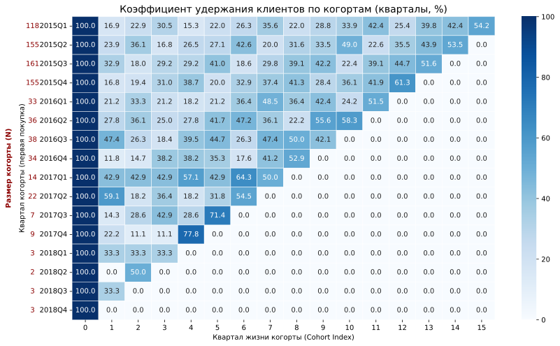
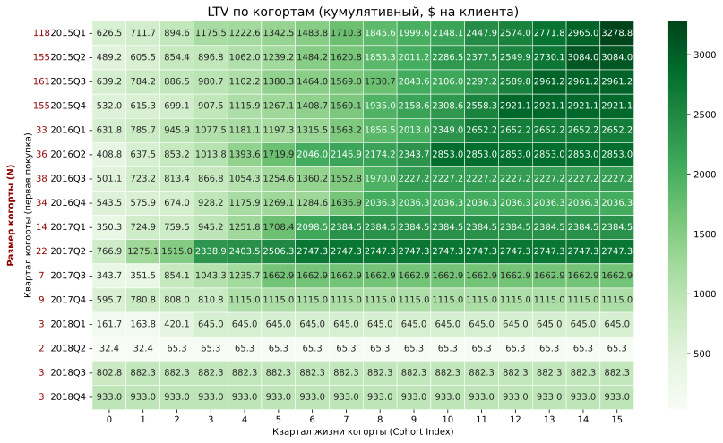
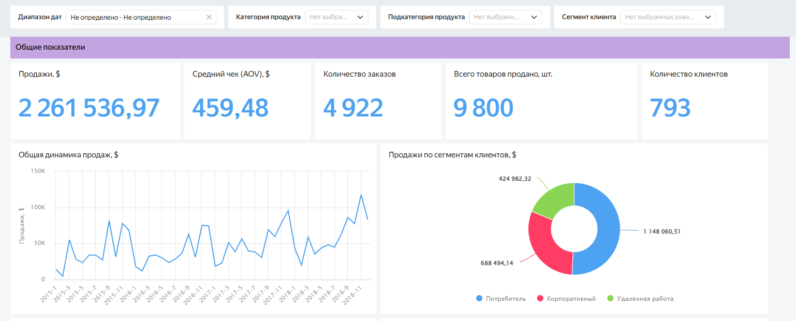
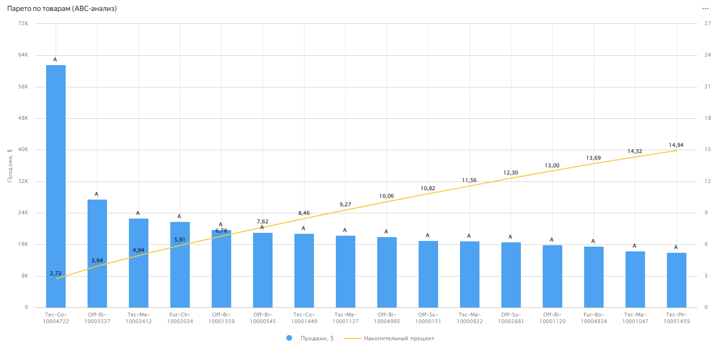
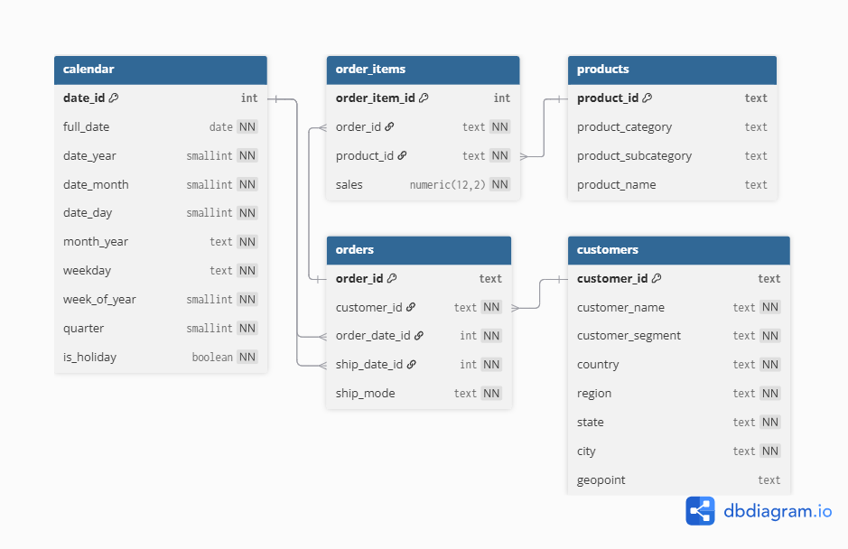

# Аналитика продаж супермаркета (Superstore Sales)

## Короткое описание
&nbsp;&nbsp;&nbsp;&nbsp;В проекте использовался датасет о продажах большого магазина (Kaggle), выполнены очистка и трансформация данных, датасет обогащён гео-информацией (геоточки городов для построени карты в дальнейшем), проведён когортный и RFM анализ, рассчитан LTV. Подготовленные данные нормализованы и загружены в БД PostgreSQL. Созданы несколько аналитических VIEW для удобства построения чартов в BI (Yandex DataLens).

**Стек:** 
- БД: PostgreSQL (нормализация, оконные функции, CTE, витрины),
- ETL и разведочный анализ: Python (pandas, numpy, matplotlib),
- BI (дашборд): Yandex DataLens.

**Источник данных** (продажи): https://www.kaggle.com/datasets/vivek468/superstore-dataset-final  
*Вспомогательный источник данных* (геоточки городов): https://simplemaps.com/data/us-cities

## Обзор результатов

<table align="center" border="0" cellspacing="0" style="border:none; width:98%;">

  <tr style="border:none;">
    <td align="center" style="border:none; vertical-align:top; width:48%; background-color:white; padding:5px;">
      <a href="images/retention_heatmap.svg"></a>
      <br>(а)
    </td>
    <td align="center" style="border:none; vertical-align:top; width:48%; background-color:white; padding:5px;">
      <a href="images/LTV_heatmap.svg"></a>
      <br>(б)
    </td>
  </tr>

  <tr style="border:none;">
    <td align="center" style="border:none; vertical-align:top; width:48%; background-color:white; padding:5px;">
      <a href="images/dashboard_screen.PNG"></a>
      <br>(в)
    </td>
    <td align="center" style="border:none; vertical-align:top; width:48%; background-color:white; padding:5px;">
      <a href="images/pareto_chart.PNG"></a>
      <br>(г)
    </td>
  </tr>
</table>

<div align="center">
  <p style="font-size:90%; color:gray; margin-top:10px; text-align:left; max-width:900px;">
    <b>Обзор проекта:</b> (а) — когортный анализ (удержание); (б) — когортный анализ (LTV); (в) — фрагмент дашборда; (г) — ABC-анализ товаров
  </p>
</div>

**Выводы**  
&nbsp;&nbsp;&nbsp;&nbsp;Выяснилось, что прибыль магазина **чрезмерно** сильно зависит от старого ядра клиентов и, несмотря на растущую прибыль, магазин находится в рискованной ситуации: уход даже 10% старых когорт - не покроет полного ухода когорт 2017-2018. Магазин быстро вышел на "плато" по клиентам, но **количество новых клиентов снизилось на 77%** за один год.  
Из плюсов - **когорты демонстрируют сильное удержание**, часто превышая 40%. Скорее всего, это объясняется тем, что ассортимент востребован преимущественно офисами и фрилансерами, которые, найдя поставщика, закупаются разово и в дальнейшем только пополняют запасы. Прослеживается периодичность покупок, вероятно связанная с закупкой перед после отпусков / каникул и возобновлением активных работ осенью.  

**Рекомендации**:  
&nbsp;&nbsp;&nbsp;&nbsp;Магазину срочно нужен приток "свежей крови" - нужно привлечь новых клиентов: (a) оценить географию и понять - полностью ли насыщен ли рынок; если да - расширять гео, (b) если нет - оценить CAC, понять, что изменилось в 2016 году, (c) попробовать рынок, где мебель и крупные товары имеют малый срок службы в силу производственных условий (малые производства, фрилансеры-ремесленники, мастерские). Также стоит рассмотреть вариант увеличения продаж расходных товаров, которые покупаются чаще, чем крупный товар типа мебели и компьютерной техники. Когорта 2018Q2 очень слабая: большинство усилий по привлечению в этот квартал оказались неэффективны и необходимо детально рассмотреть какие шаги предпринимал магазин в это время, особенно отдел маркетинга.

## Содержание
- [Короткое описание](#короткое-описание)
- [Обзор результатов](#обзор-результатов)
- [Ключевые пункты](#ключевые-пункты)
- [Архитектура](#архитектура)
- [Структура репозитория](#структура-репозитория)
- [Ключевые результаты и вычисляемые метрики](#ключевые-результаты-и-вычисляемые-метрики)
- [Дашборд](#дашборд)
- [Быстрый запуск](#быстрый-запуск)
- [Примечание о DataLens](#примечание-о-datalens)


## Ключевые пункты
- ETL/EDA: очистка данных, расчёт метрик (RFM, когорты, LTV) и подготовка файлов для загрузки в БД.
- Преобразования: добавлены дополнительные поля, такие как `order_date_id`, `ship_date_id`; заполнены пропущенные почтовые индексы;
- Гео‑обогащение: объединение с источником геоточек городов с корректировками названий и дополнением недостающих координат.
- Нормализация данных и загрузка в PostgreSQL: таблицы `order_items` (факт), `orders`, `customers`, `products`, `calendar`. 
- Витрины: общая витрина (гранулярность по заказам) `v_sales_report`, квартальное удержание для когортного анализа `cohort_analysis`, годовая активность клиентов (CRR/RPR) `customer_yearly_activity`.

## Архитектура
1.  **Exploratory Data Analysis (EDA) & ETL** (`01_superstore_eda_etl.ipynb`):
    * Анализ качества данных, очистка.
    * Разведочный анализ данных, RFM-анализ, когортный анализ для быстрого определения проблемных мест.
    * Обогащение данных геоточками.
    * Трансформация данных для соответствия реляционной схеме.
2.  **Нормализация** (`02_superstore_normalization_schema.sql`):
    * Проектирование схемы с пятью таблицами (факт `order_items`, измерения `orders`, `customers`, `products`, `calendar`).
3.  **Витрины (data marts)** (`03_analytics_view.sql`):
    * Создание оптимизированных `VIEW` для ускоренной отчётности.
4.  **Визуализация**:
    * Интерактивный дашборд в Yandex DataLens для мониторинга KPI.


    
<div align="center">
  <br>
    
  <p style="font-size:90%; color:gray; margin-top:10px; text-align:left; max-width:900px;">
    Схема БД PostgreSQL
  </p>
</div>
  
## Структура репозитория

| Файл | Назначение |
| :--- | :--- |
| `01_superstore_eda_etl.ipynb` | Подготовка и очистка данных, первичный анализ, обогащение данных, загрузка в БД |
| `02_superstore_normalization_schema.sql` | Скрипт **DDL** для создания нормализованной схемы PostgreSQL |
| `03_analytics_view.sql` | Скрипт для создания трех аналитических `VIEW` (витрин данных) |
| `ER_diagram_superstore.png` | Визуальное представление реляционной модели (снежинка) |
| `requirements.txt` | Список зависимостей Python |
| `README.md` | Обзор и документация проекта (с ссылкой на дашборд) |

## Ключевые результаты и вычисляемые метрики

&nbsp;&nbsp;&nbsp;&nbsp;В проекте реализован расчет и анализ следующих ключевых бизнес-показателей:

* **Когортный анализ:** витрины для измерения LTV и удержания клиентов поквартально.
* **Удержание клиентов (CRR/RPR):** витрина для расчета метрик активности клиентов по годам, включая использование оконной функции `LAG` для определения **предыдущего года активности**.
* **Логистика:** расчет времени доставки в днях (`ship_time_days`).
* **Гео-аналитика:** детальная разбивка продаж и прибыльности по регионам, штатам и городам.
* **ABC-анализ товаров:** определение наиболее прибыльных товаров, оценка эффективности ассортимента.
* **Определение старых товаров:** расчет товаров, которые давно не покупаются. 

## Дашборд

Интерактивный дашборд разработан в **Yandex DataLens** для отслеживания динамики продаж, прибыльности и поведенческих метрик клиентов.

➡️ **Дашборд в открытом доступе, можно протестировать**: https://datalens.yandex/t0aal77eif0ge

## Быстрый запуск

&nbsp;&nbsp;&nbsp;&nbsp;Для локального воспроизведения аналитического пайплайна выполните следующие шаги:

1.  Скачать репозиторий:
    ```bash
    git clone https://github.com/evroshs/superstore_bi_project.git
    ```
2.  Установить библиотеки:
    ```bash
    pip install -r requirements.txt
    ```
3.  Запустить ноутбук `01_superstore_eda_etl.ipynb` для загрузки и трансформации данных. PostgreSQL схема будет развёрнута в процессе выполнения ячеек ноутбука из файла `02_superstore_normalization_schema.sql`.
4.  Создать аналитические витрины, выполнив скрипт `03_analytics_view.sql`.
### Примечание о DataLens

&nbsp;&nbsp;&nbsp;&nbsp;В облачной версии Yandex DataLens прямое подключение к локальной PostgreSQL БД требовало бы настройки VPN/SSH-туннелирования или размещения БД в облаке. Для упрощения демонстрации был использован следующий подход:

1.  Данные из аналитических `VIEW` были **экспортированы в CSV-файлы**.
2.  Эти CSV-файлы были загружены в DataLens в качестве **источников данных**.

### Следующие шаги:
В дашборд можно будет добавить более широкое использование параметров (функционал DataLens) для переключения между разными типами категорий на одном чарте, добавить сравнение с предыдущим периодом. Затем построить регрессионную модель, прогнозируя продажи.
